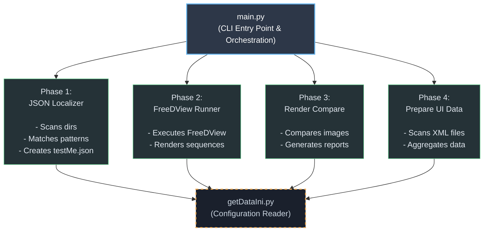

# FreeDView Tester

Automated testing and comparison tool for FreeDView renderer versions. This tool helps compare rendered outputs from different FreeDView versions to identify visual differences and regressions.

## TL;DR

-   **Pipeline Automation**: Four-phase Python CLI tool managing JSON localization, rendering, comparison, and XML data aggregation.
-   **Process Management**: Executes external rendering engines via `subprocess` for multi-version batch rendering.
-   **Image Analysis**: Calculates MSE and SSIM metrics, and generates diff/alpha maps using OpenCV and scikit-image.
-   **Concurrency**: Implements multi-threading at both folder and frame levels to accelerate batch image processing.
-   **Data Export**: Generates structured XML reports with relative paths for cross-platform consumption by UI tools.

**Quick Start:**
```bash
pip install opencv-python numpy scikit-image
python src/main.py all
```

------------------------------------------------------------------------

## Overview

FreeDView Tester is a four-phase automated testing pipeline designed to identify visual differences between FreeDView renderer versions. The tool processes test sets, renders them using different FreeDView versions, and provides comprehensive comparison analysis with aggregated results ready for UI visualization.


### Project Inspiration
This tool was inspired by a custom internal utility I developed for my team during my tenure as a CG Engineer at Intel. While the original tool served specific automated testing needs, this personal project was rebuilt entirely from scratch to create a robust, standalone automated testing and rendering pipeline.

The system follows a modular architecture: each phase is implemented as an independent module. The phases communicate through file-based data exchange, keeping the workflow efficient, stable, and easy to extend.

Phase 2 integrates with the FreeDView renderer executable using Python's `subprocess` module, demonstrating advanced process management capabilities including stdout/stderr capture, error handling, and return code validation.

This modular design allows each component to evolve independently and makes the suite maintainable and scalable.

------------------------------------------------------------------------

# Phase Breakdown (High-Level Responsibilities)

## Phase 1: JSON Localizer - Path Localization

The main module that localizes JSON configuration files for rendering.

### Features:

-   Scans test sets directory for `standAloneRender.json` files
-   Pattern-based matching for events and sets (supports `#` wildcards)
-   Creates localized `testMe.json` files with updated paths
-   Supports flexible directory structures (Event, SportType/Event, SportType/Stadium/Event, etc.)
-   Preserves all JSON structure while updating paths

------------------------------------------------------------------------

## Phase 2: FreeDView Runner - Rendering Execution

Executes FreeDView renderer on localized JSON files.

### Features:

-   Reads localized `testMe.json` files created by Phase 1
-   Executes FreeDView renderer as subprocess
-   Renders image sequences for multiple versions (original and test)
-   Processes frame ranges from JSON configuration
-   Renames output images to sequential format
-   Organizes output in structured directories

------------------------------------------------------------------------

## Phase 3: Render Compare - Image Comparison & Analysis

Compares rendered images between versions and generates reports.

### Features:

-   Compares image pairs from original and test versions
-   Calculates MSE (Mean Squared Error) and SSIM (Structural Similarity Index) metrics
-   Generates visual difference images with HOT colormap
-   Creates alpha mask images using Otsu thresholding
-   Generates XML reports with per-frame comparison data
-   Extracts metadata from directory structure
-   **Performance Optimization**: Frame-level parallelization using thread pools for concurrent image processing
-   **Portable Data Storage**: Stores relative paths in XML files for cross-platform compatibility and data portability

### Performance Enhancements

Phase 3 implements two levels of parallelization to maximize throughput:

-   **Folder-level parallelism**: Processes multiple comparison folders concurrently
-   **Frame-level parallelism**: Processes multiple frames within each folder concurrently using configurable thread pools (default: 2 threads per folder)

This dual-level approach significantly reduces processing time for large test suites. The frame-level parallelization particularly accelerates the computationally intensive operations of image comparison, difference image generation, and alpha mask creation, resulting in 2-3x performance improvements for folders with many frames.

### Relative Path Storage

All paths stored in XML files are converted to relative paths (relative to the `testSets_results` root directory). This design decision provides several benefits:

-   **Data Portability**: Comparison results can be moved or copied to different locations while maintaining valid path references
-   **Cross-Platform Compatibility**: Relative paths work consistently across Windows, Linux, and macOS
-   **Self-Contained Data**: XML files contain all necessary path information without machine-specific absolute paths
-   **Version Control Friendly**: Relative paths are more suitable for version control systems

The [renderCompare](https://github.com/PerryGu/renderCompare) UI tool resolves these relative paths at runtime based on the configured `testSets_results` location, ensuring flexibility while maintaining data integrity.

------------------------------------------------------------------------

## Phase 4: Prepare UI Data - Data Aggregation with Status Tracking

Aggregates comparison results from all test sets into a unified XML file for UI visualization, while tracking the completion status of each test.

### Features:

-   **Comprehensive Test Discovery**: Recursively scans `testSets` folder structure to discover all potential tests (regardless of completion status)
-   **Status Tracking**: Compares `testSets` with `testSets_results` to determine completion status for each test:
    -   **"Ready"**: Test has completed comparison (Phase 3 complete, `compareResult.xml` exists)
    -   **"Rendered not compare"**: Test has rendered images but no comparison yet (Phase 2 complete, Phase 3 not run)
    -   **"Not Ready"**: Test exists in `testSets` but no results found (not yet rendered)
-   **Flexible Folder Structure Support**: Handles varying directory hierarchies (with or without team/field/stadium/category folders)
-   **Data Aggregation**: Recursively scans `testSets_results` for all `compareResult.xml` files and extracts metrics
-   **Render Version Discovery**: Automatically discovers and collects all unique render version folder names (folders containing "_VS_") from `testSets_results` and includes them in `uiData.xml`
-   **Render Version Association**: Extracts and associates render version folder names with each test entry, enabling UI filtering by render version
-   **Bootstrap Capability**: Can create `uiData.xml` even when `testSets_results` doesn't exist, marking all tests as "Not Ready"
-   **Automated Updates**: Merges test discovery with completed comparisons to create/update `uiData.xml` with complete status information
-   **Thumbnail Generation**: Generates thumbnail paths for visual preview, including for tests with "Rendered not compare" status (extracts from first render folder when Phase 3 hasn't been run)
-   **Portable Data Storage**: All paths stored as relative paths for cross-platform compatibility

### Design Philosophy

Phase 4 was designed with comprehensive test management and data portability in mind. By scanning both `testSets` and `testSets_results`, the tool provides a complete view of test status across the entire test suite. The aggregation process:

-   **Test Status Visibility**: Enables [renderCompare](https://github.com/PerryGu/renderCompare) UI tools to display which tests are ready, partially complete, or not yet started
-   **Bootstrap Support**: Allows [renderCompare](https://github.com/PerryGu/renderCompare) UI tools to show all available tests even before rendering begins
-   **Unified Data Model**: Provides a single source of truth for test metadata, metrics, and status
-   **Flexible Discovery**: Automatically adapts to different folder structures (SportType/Event/Set/Frame, SportType/Team/Event/Set/Frame, etc.)
-   Preserves all essential metadata from individual comparisons
-   Maintains relative path references for complete portability
-   Provides summary statistics for quick overview
-   Enables efficient UI rendering by pre-computing display data

This phase can run independently at any time to update test status, or as part of the complete pipeline, providing flexibility for different workflow needs.

------------------------------------------------------------------------

## Architecture

The system follows a modular architecture:

- **Core Modules** (`src/main.py`, `src/jsonLocalizer.py`, `src/freeDViewRunner.py`, `src/renderCompare.py`, `src/prepareUIData.py`): Independent phase implementations
  - Each phase can run independently or as part of the complete pipeline
  - File-based communication between phases
  - Consistent error handling and logging
  - Performance-optimized with multi-level parallelization

- **Utilities** (`getDataIni.py`): Configuration file reading utility
  - INI file parsing with error handling
  - Backward compatibility support
  - Validation and logging

- **Shared Patterns**: Consistent code style, logging, error handling across all modules

### Data Flow

```
Configuration (INI file)
    ↓
JSON Localizer (Phase 1)
    ├── Scans testSets directory
    ├── Matches events/sets by pattern
    └── Creates localized testMe.json files
    ↓
FreeDView Runner (Phase 2)
    ├── Reads testMe.json files
    ├── Executes FreeDView renderer
    └── Generates rendered image sequences
    ↓
Render Compare (Phase 3)
    ├── Loads images from both versions
    ├── Calculates comparison metrics (parallel frame processing)
    ├── Generates diff/alpha images
    └── Creates XML reports (with relative paths)
    ↓
Prepare UI Data (Phase 4)
    ├── Scans testSets folder structure (discovers all tests)
    ├── Scans testSets_results (finds completed comparisons)
    ├── Collects render version folder names (folders with "_VS_")
    ├── Determines status for each test (Ready/Rendered not compare/Not Ready)
    ├── Extracts and aggregates metadata
    ├── Generates thumbnail paths (including for "Rendered not compare" status)
    └── Creates/updates unified uiData.xml with status and render versions
```

## Performance

- **Progress Tracking**: Real-time progress indication for long operations
- **Error Resilience**: Continues processing when individual items fail
- **Logging**: Detailed logging with configurable verbosity levels
- **Validation**: Comprehensive input validation before processing
- **Multi-Level Parallelization**: 
  - Folder-level: Processes multiple comparison folders concurrently
  - Frame-level: Processes multiple frames within folders concurrently (Phase 3)
  - Configurable thread pools for optimal resource utilization
- **Performance Metrics**: Summary statistics showing processing time and throughput

------------------------------------------------------------------------

# Architecture Diagram



------------------------------------------------------------------------

## Project Structure

```markdown
📁 freeDView_tester/
│
├── 📁 src/                    # Source code
│   ├── 📄 __init__.py
│   ├── 📄 main.py            # Main CLI entry point and orchestration
│   ├── 📄 jsonLocalizer.py   # Phase 1: JSON file localization
│   ├── 📄 freeDViewRunner.py # Phase 2: FreeDView rendering execution
│   ├── 📄 renderCompare.py   # Phase 3: Image comparison and analysis
│   ├── 📄 prepareUIData.py   # Phase 4: UI data aggregation
│   └── 📄 getDataIni.py      # INI configuration file reader utility
│
├── 📁 tests/                  # Unit tests
│   ├── 📄 README.md           # Testing documentation
│   ├── 📄 test_get_data_ini.py
│   ├── 📄 test_json_localizer.py
│   └── 📄 test_render_compare.py
│
├── 📄 freeDView_tester.ini    # Configuration file (paths, versions, patterns)
└── 📄 README.md               # This file
```

------------------------------------------------------------------------

## Installation

### Prerequisites

- Python 3.8 or higher
- FreeDView executable
- Test sets directory with JSON configuration files

### Setup Steps

1. **Clone or download the project:**
   ```bash
   git clone <repository-url>
   cd freeDView_tester
   ```

2. **Install Python dependencies:**
   ```bash
   pip install -r requirements.txt
   ```
   
   Or install manually:
   ```bash
   pip install opencv-python numpy scikit-image
   ```

3. **Configure the INI file:**
   - Edit `freeDView_tester.ini` with your paths and settings
   - See Configuration section for detailed parameter descriptions

4. **Verify FreeDView executable:**
   - Ensure FreeDView is accessible at the path specified in INI file
   - Verify executable permissions

5. **Verify test sets structure:**
   - Check that test sets directory contains `standAloneRender.json` files
   - Ensure directory structure matches expected patterns (see Configuration)

------------------------------------------------------------------------

## Usage

### Basic Workflow

**Run Complete Pipeline:**
```bash
python src/main.py all
```

**Run Individual Phases:**
```bash
# Phase 1: JSON Localizer
python src/main.py localize

# Phase 2: FreeDView Runner
python src/main.py render

# Phase 3: Render Compare
python src/main.py compare

# Phase 4: Prepare UI Data
python src/main.py prepare-ui
```

**Custom INI File:**
```bash
python src/main.py all --ini path/to/custom.ini
```

**Multiple Version Comparisons (Multiple INI Files):**

To compare multiple version groups, create separate INI files for each comparison and run them sequentially:

```bash
# Create separate INI files for each version comparison
# freeDView_tester_v1.ini - compares version1_VS_version2
# freeDView_tester_v2.ini - compares version3_VS_version4

# Run each comparison
python src/main.py all --ini freeDView_tester_v1.ini
python src/main.py all --ini freeDView_tester_v2.ini
```

Each INI file should contain one `freedviewVer` entry. The tool will process all JSON files found in `setTestPath` for each version comparison, running them in parallel using multi-threading.

**Verbose Logging:**
```bash
python src/main.py all --verbose
```

**UI Comparison Mode:**
```bash
python src/main.py compare-ui folder_frame_path freedview_path_tester freedview_path_orig freedview_name_orig freedview_name_tester
```

### Directory Structure

This section explains the directory structure at different stages of the pipeline.

#### Input Structure (testSets/)

The input directory contains test sets with JSON configuration files:

```
testSets/
└── SportType/                    # Optional: e.g., NFL, Football
    └── EventName/                # e.g., E17_01_07_16_01_25_LIVE_05
        └── SetName/              # e.g., S170123190428
            └── F####/            # Frame folder (actually a SEQUENCE), e.g., F0224
                └── Render/
                    └── Json/
                        └── standAloneRender.json    # Contains startFrame, endFrame
```

#### Output Structure (testSets_results/)

Results are written to `testSets_results/` directory. The structure evolves as the pipeline progresses:

**After Phase 2 (Rendering):**

```
testSets_results/
└── SportType/                    # e.g., NFL
    └── EventName/                # e.g., E17_01_07_16_01_25_LIVE_05
        └── SetName/              # e.g., S170123190428
            └── F####/            # e.g., F0224
                └── freedview_version1_VS_version2/    # Comparison folder
                    ├── freedview_version1/           # Original version images
                    │   ├── 0135.jpg                  ← Frame 135
                    │   ├── 0136.jpg                  ← Frame 136
                    │   ├── 0137.jpg                  ← Frame 137
                    │   └── ...                       ← Sequential frames
                    └── freedview_version2/           # Test version images
                        ├── 0135.jpg                  ← Frame 135
                        ├── 0136.jpg                  ← Frame 136
                        └── ...                       ← Sequential frames
```

**Example path:** `testSets_results/NFL/E17_01_07_16_01_25_LIVE_05/S170123190428/F0224/freedview_1.3.2.0_1.0.0.3_VS_freedview_1.3.5.0_1.0.0.0/`

**After Phase 3 (Comparison):**

```
testSets_results/
└── SportType/                    # e.g., NFL
    └── EventName/                # e.g., E17_01_07_16_01_25_LIVE_05
        └── SetName/              # e.g., S170123190428
            └── F####/            # e.g., F0224
                └── freedview_version1_VS_version2/    # Comparison folder
                    ├── freedview_version1/           # Rendered images (original version)
                    ├── freedview_version2/           # Rendered images (test version)
                    └── results/
                        ├── compareResult.xml          # ONE XML with data for ALL frames (relative paths)
                        ├── diff_images/              # Visual difference images (ONE per frame)
                        │   ├── 0135.jpg              ← Diff image for frame 135
                        │   ├── 0136.jpg              ← Diff image for frame 136
                        │   ├── 0137.jpg              ← Diff image for frame 137
                        │   └── ...                   ← One diff image per frame
                        └── alpha_images/             # Alpha mask images (ONE per frame)
                            ├── 0135.png              ← Alpha mask for frame 135
                            ├── 0136.png              ← Alpha mask for frame 136
                            ├── 0137.png              ← Alpha mask for frame 137
                            └── ...                   ← One alpha mask per frame
```

**After Phase 4 (UI Data Aggregation):**

```
testSets_results/
├── uiData.xml                    # Aggregated data for UI (all comparisons)
└── SportType/                    # e.g., NFL
    └── EventName/                # e.g., E17_01_07_16_01_25_LIVE_05
        └── SetName/              # e.g., S170123190428
            └── F####/            # e.g., F0224
                └── freedview_version1_VS_version2/
                    └── results/
                        └── compareResult.xml          # Individual comparison data
```

**Note:** Frame numbers use 4-digit format with leading zeros (e.g., `0135.jpg`, `0136.jpg`). The actual frame numbers depend on the `startFrame` and `endFrame` values in the `standAloneRender.json` file.

### XML Report Structure

The `compareResult.xml` file contains aggregated comparison data for all frames in a sequence. Here's an example structure:

```xml
<?xml version="1.0" ?>
<root>
    <sourcePath>D:/testSets_results/EventName/SetName/F1234/freedview_ver/version_orig</sourcePath>
    <testPath>D:/testSets_results/EventName/SetName/F1234/freedview_ver/version_test</testPath>
    <diffPath>D:/testSets_results/EventName/SetName/F1234/results/diff_images</diffPath>
    <alphaPath>D:/testSets_results/EventName/SetName/F1234/results/alpha_images</alphaPath>
    <origFreeDView>freedview_1.2.1.6_1.0.0.5</origFreeDView>
    <testFreedview>freedview_1.2.1.6_1.0.0.8</testFreedview>
    <eventName>E##_##_##_##_##_##__</eventName>
    <sportType>Football</sportType>
    <stadiumName>StadiumA</stadiumName>
    <categoryName>Category1</categoryName>
    <startFrame>0100</startFrame>
    <endFrame>0150</endFrame>
    <minVal>0.985</minVal>
    <maxVal>0.999</maxVal>
    <frames>
        <frame>
            <frameIndex>100</frameIndex>
            <value>0.998</value>
        </frame>
        <frame>
            <frameIndex>101</frameIndex>
            <value>0.997</value>
        </frame>
        <frame>
            <frameIndex>102</frameIndex>
            <value>0.996</value>
        </frame>
        <!-- ... more frames ... -->
        <frame>
            <frameIndex>149</frameIndex>
            <value>0.986</value>
        </frame>
        <frame>
            <frameIndex>150</frameIndex>
            <value>0.985</value>
        </frame>
    </frames>
</root>
```

**XML File Notes:**
- **One XML file per frame folder** 
- Contains metadata: paths (stored as relative paths for portability), version names, event/sport/stadium info, frame range
- Contains per-frame SSIM values in the `<frames>` section
- `minVal` and `maxVal` represent the minimum and maximum SSIM values across all frames
- Each `<frame>` element contains `frameIndex` and `value` (SSIM score)
- **All paths are relative** to the `testSets_results` root directory for cross-platform compatibility and data portability

### UI Data XML Structure (Phase 4)

Phase 4 generates `uiData.xml` in the `testSets_results` root, containing aggregated data from all tests with status tracking. The file includes all tests discovered in `testSets`, regardless of completion status:

```xml
<?xml version="1.0" ?>
<uiData>
    <renderVersions>
        <version>freedview_1.2.1.3_1.0.0.7_VS_freedView_1.3.0.0_1.0.0.1</version>
        <version>freedview_1.3.2.0_1.0.0.3_VS_freedview_1.3.5.0_1.0.0.0</version>
        <!-- Additional render version folder names... -->
    </renderVersions>
    <entries>
        <entry>
            <id>1</id>
            <eventName>E16_05_16_18_04_00__LIVE_01</eventName>
            <sportType>NBA</sportType>
            <stadiumName></stadiumName>
            <categoryName></categoryName>
            <numberOfFrames>285</numberOfFrames>
            <minValue>0.985</minValue>
            <numFramesUnderMin>42</numFramesUnderMin>
            <thumbnailPath>NBA/EventName/SetName/F0525/freedview_1.2.1.3_1.0.0.7/0001.jpg</thumbnailPath>
            <status>Ready</status>
            <notes></notes>
            <renderVersions>freedview_1.3.2.0_1.0.0.3_VS_freedview_1.3.5.0_1.0.0.0</renderVersions>
        </entry>
        <entry>
            <id>2</id>
            <eventName>E15_08_10_19_51_35__LIVE_10</eventName>
            <sportType>MLB</sportType>
            <stadiumName>Dodgers</stadiumName>
            <categoryName></categoryName>
            <numberOfFrames>0000</numberOfFrames>
            <minValue>0.0000</minValue>
            <numFramesUnderMin>0</numFramesUnderMin>
            <thumbnailPath>MLB/Dodgers/E15_08_10_19_51_35__LIVE_10/S160320083938/F0388/freedview_1.2.1.3_1.0.0.7/0001.jpg</thumbnailPath>
            <status>Rendered not compare</status>
            <notes></notes>
            <renderVersions>freedview_1.2.1.3_1.0.0.7_VS_freedView_1.3.0.0_1.0.0.1</renderVersions>
        </entry>
        <entry>
            <id>3</id>
            <eventName>E16_02_07_18_27_43_LIVE_24</eventName>
            <sportType>NFL</sportType>
            <stadiumName></stadiumName>
            <categoryName></categoryName>
            <numberOfFrames>0000</numberOfFrames>
            <minValue>0.0000</minValue>
            <numFramesUnderMin>0</numFramesUnderMin>
            <thumbnailPath></thumbnailPath>
            <status>Not Ready</status>
            <notes></notes>
            <renderVersions></renderVersions>
        </entry>
        <!-- Additional entries... -->
    </entries>
</uiData>
```

**UI Data XML Notes:**
- **One XML file for all tests** in the `testSets_results` root (includes all tests from `testSets`, not just completed ones)
- **Render Versions Section**: Contains a `<renderVersions>` section listing all unique render version folder names found in `testSets_results` (folders with names containing "_VS_", e.g., `freedview_1.2.1.3_1.0.0.7_VS_freedView_1.3.0.0_1.0.0.1`). Each version appears only once, sorted alphabetically for consistent ordering.
- Contains aggregated metadata from all `compareResult.xml` files (for completed tests)
- Includes **status field** for each test: `"Ready"` (Phase 3 complete), `"Rendered not compare"` (Phase 2 complete, Phase 3 not run), or `"Not Ready"` (not yet rendered)
- Includes thumbnail paths (relative) for visual preview:
    - For "Ready" status: Thumbnail extracted from `compareResult.xml` sourcePath
    - For "Rendered not compare" status: Thumbnail extracted from first render folder (e.g., `freedview_1.2.1.3_1.0.0.7`) when Phase 3 hasn't been run
    - For "Not Ready" status: Empty thumbnail path
- **Render Versions Field**: Each `<entry>` includes a `<renderVersions>` field containing the render version folder name(s) that the test belongs to:
    - Extracted from the test's folder structure in `testSets_results` (e.g., `F####/freedview_X_VS_Y/`)
    - For tests with completed comparisons: Extracted from the `compareResult.xml` file path or thumbnail path
    - For tests with rendered images but no comparison: Extracted from the render folder structure
    - For "Not Ready" tests: Empty string (no render versions yet)
    - Format: Comma-separated list if a test belongs to multiple render versions (e.g., `"version1,version2"`)
    - Enables [renderCompare](https://github.com/PerryGu/renderCompare) UI tools to filter tests by render version using a comboBox dropdown
    - Supports "All render versions" mode (default) which displays all tests regardless of render version
- Provides summary statistics for quick overview
- Designed for efficient loading in UI applications
- Enables [renderCompare](https://github.com/PerryGu/renderCompare) UI tools to display test completion status and identify which tests still need processing
- Enables [renderCompare](https://github.com/PerryGu/renderCompare) UI tools to discover and filter by available render version comparisons

------------------------------------------------------------------------

# Dependencies

### Python Packages

-   **opencv-python** (cv2): Image processing and comparison
-   **numpy**: Numerical operations for image analysis
-   **scikit-image**: SSIM (Structural Similarity Index) calculation
-   **configparser**: Built-in Python module for INI file parsing (included in Python standard library)

### Installation Command

```bash
pip install opencv-python numpy scikit-image
```

------------------------------------------------------------------------

# Requirements

-   **Python**: 3.8 or later
-   **FreeDView**: Executable must be available at path specified in INI file
-   **Test Sets**: Directory structure with JSON configuration files matching the patterns specified in INI file

------------------------------------------------------------------------

# Configuration

The tool is configured via `freeDView_tester.ini`:

```ini
[freeDView_tester]
setTestPath = D:\freeDView_tester\testSets
freedviewPath = D:\freeDView_tester\freedviewVer
freedviewVer = freedview_1.2.1.6_1.0.0.5_VS_freedview_1.2.1.6_1.0.0.8
eventName = E##_##_##_##_##_##__
setName = S####
run_on_test_list = []
```

### Configuration Parameters

| Parameter | Description | Example |
|-----------|-------------|---------|
| `setTestPath` | Base path to test sets directory | `D:\freeDView_tester\testSets` |
| `freedviewPath` | Path to FreeDView version directories | `D:\freeDView_tester\freedviewVer` |
| `freedviewVer` | Version string format: `version1_VS_version2` | `freedview_1.2.1.6_1.0.0.5_VS_freedview_1.2.1.6_1.0.0.8` |
| `eventName` | Pattern to match event folders (`#` = digit) | `E##_##_##_##_##_##__` |
| `setName` | Pattern to match set folders (`#` = digit) | `S####` |
| `run_on_test_list` | Optional: List of test keys to process (empty `[]` = process all tests) | `[]` or `[SportType/Event/Set/F####]` |

### Test Filtering with `run_on_test_list`

The `run_on_test_list` parameter allows you to specify which tests to process in Phases 1-3. This is useful when you want to:
- Run specific tests without processing the entire test suite
- Re-run failed tests
- Process tests incrementally
- Batch process multiple selected tests from the [renderCompare](https://github.com/PerryGu/renderCompare) UI tool

**Format:**
- Empty `[]`: Process all tests (default behavior)
- Single test: `[SportType/Event/Set/F####]` where the path is relative to `testSets` root
- Multiple tests: `[test1, test2, test3]` (comma-separated list within brackets)

**Examples:**
```ini
# Process all tests
run_on_test_list = []

# Process a single test
run_on_test_list = [NFL/E17_01_07_16_01_25_LIVE_05/S170123190428/F0224]

# Process multiple tests (comma-separated)
run_on_test_list = [NFL/E17_01_07_16_01_25_LIVE_05/S170123190428/F0224, MLB/Dodgers/E15_08_10_19_51_35__LIVE_10/S160320083938/F0388, NBA/E16_05_16_18_04_00__LIVE_01/S170516180400/F0211]
```

**UI Tool Integration:**
The complementary [renderCompare](https://github.com/PerryGu/renderCompare) UI tool can automatically update this parameter when you select multiple rows and choose to run test commands:
- Select multiple rows using Ctrl+Click
- Right-click and choose "Run All Phases" or "Run Phase 3"
- The UI tool automatically formats all selected test keys as a comma-separated list
- Example output: `run_on_test_list = [NFL/E17_01_07_16_01_25_LIVE_05/S170123190428/F0224, MLB/Dodgers/E15_08_10_19_51_35__LIVE_10/S160320083938/F0388]`

**Note:** Phase 4 (Prepare UI Data) always processes all tests regardless of `run_on_test_list` to maintain a complete `uiData.xml` file. The `run_on_test_list` parameter only affects Phases 1-3.

### Setup Steps

1.  Edit `freeDView_tester.ini` with your paths and settings
2.  Ensure FreeDView executable is accessible at the specified path
3.  Verify test sets directory structure matches expected patterns
4.  Run a test to verify configuration: `python src/main.py localize --verbose`

### Multiple Version Comparisons

The tool supports two modes for handling multiple version comparisons:

**Mode 1: Automatic Discovery (Recommended)**
Set `freedviewVer = ""` (empty) in the INI file to automatically discover and process all version comparison folders in `testSets_results`. This eliminates the need to manually configure each version comparison and allows the tool to process all available comparisons in a single run.

**Mode 2: Explicit Version Specification**
For comparing specific version groups, create separate INI files for each comparison:

**Example - Multiple INI Files:**

```ini
# freeDView_tester_v1.ini
[freeDView_tester]
setTestPath = D:\freeDView_tester\testSets
freedviewPath = D:\freeDView_tester\freedviewVer
freedviewVer = freedview_1.2.1.6_1.0.0.5_VS_freedview_1.2.1.6_1.0.0.8
eventName = E##_##_##_##_##_##__
setName = S####
```

```ini
# freeDView_tester_v2.ini
[freeDView_tester]
setTestPath = D:\freeDView_tester\testSets
freedviewPath = D:\freeDView_tester\freedviewVer
freedviewVer = freedview_1.3.0.0_1.0.0.0_VS_freedview_1.3.5.0_1.0.0.0
eventName = E##_##_##_##_##_##__
setName = S####
```

**Run each comparison:**
```bash
python src/main.py all --ini freeDView_tester_v1.ini
python src/main.py all --ini freeDView_tester_v2.ini
```

**Benefits of multiple INI files:**
- **Clear separation**: Each file = one comparison task
- **Easy testing**: Test individual comparisons independently
- **Simple management**: Add/remove version groups easily
- **Better error isolation**: Errors are clearly associated with specific configurations
- **Professional practice**: Follows standard configuration management patterns

**Note:** Each INI file should contain one `freedviewVer` entry. The tool will process all JSON files found in `setTestPath` for each version comparison, running them in parallel using multi-threading.

------------------------------------------------------------------------

## Troubleshooting

### INI File Issues

**Issue: "INI file not found"**
- Verify `freeDView_tester.ini` exists in the project directory
- Or use `--ini` flag to specify custom path

**Issue: "Failed to read required configuration"**
- Check INI file format and ensure all required parameters are present
- Verify file encoding is correct (UTF-8)

### FreeDView Issues

**Issue: "FreeDView executable not found"**
- Verify the `freedviewPath` in INI file points to the correct directory
- Ensure FreeDView versions are in the expected subdirectory structure

**Issue: "Error running FreeDView"**
- Check FreeDView executable permissions
- Verify JSON files are valid and paths are correct
- Check FreeDView logs for detailed error messages

### File and Path Issues

**Issue: "No JSON files found to render"**
- Check that `setTestPath` is correct
- Verify test sets contain `standAloneRender.json` files
- Ensure event/set name patterns match your directory structure

**Issue: "Failed to read output resolution"**
- Ensure `cameracontrol.ini` exists in `dynamicINIsBackup` folder
- Verify INI file contains `outputWidth` and `outputHeight` keys

**Issue: "Images have different dimensions"**
- Verify both FreeDView versions render at the same resolution
- Check camera control INI files for both versions

### Dependency Issues

**Issue: Import errors (skimage, cv2, etc.)**
- Install missing packages: `pip install opencv-python numpy scikit-image`
- Verify Python version is 3.8 or higher
- Check virtual environment if using one

### Performance Issues

- Use `--verbose` flag to see detailed progress
- Check log files for bottlenecks
- Verify disk space is available for output

------------------------------------------------------------------------

## Testing

The project includes a comprehensive suite of unit tests to ensure the reliability of the testing pipeline. These tests cover JSON localization, INI parsing, image comparison, and data aggregation.

To run all tests:
```bash
python -m unittest discover tests
python -m unittest tests.test_render_compare

```

## Version

**Current Version**: 1.0.0  
**Python Compatibility**: 3.8+  
**Platform**: Windows (tested), Linux/Mac (should work)

## Status

Production-ready tool.  
Designed for automated FreeDView version comparison and regression testing.  
Features comprehensive error handling, logging, and progress tracking.

## Related Tools

A complementary C++/Qt UI application, [renderCompare](https://github.com/PerryGu/renderCompare), is available for visualizing and analyzing the comparison results generated by this tool. The UI tool provides an interactive interface for browsing diff images, alpha masks, and XML reports.


## Contact & Author

**Perry Guy** - Technical Artist & CG Engineer  
*Extensive experience in 3D Graphics, Tool Development, and Performance Optimization.*

📧 **Email**: [perryguy2@gmail.com](mailto:perryguy2@gmail.com)

**YouTube Channel**: [@ThePerryGuy](https://www.youtube.com/@ThePerryGuy)


## License

This project is licensed under the MIT License. See the [LICENSE](LICENSE) file for details.

